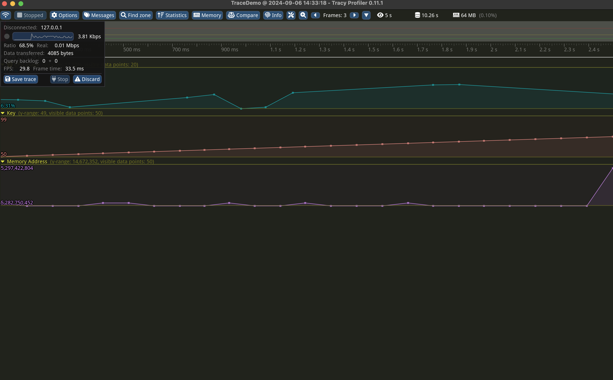

# Custom user data with Tracy example

This project demonstrates the use of the [Tracy Profiler](https://github.com/wolfpld/tracy) to profile key insertions and memory addresses during hash map operations. It streams custom counters and memory addresses to Tracy for real-time profiling.

## Overview

- **Language**: C++11
- **Profiler**: Tracy (integrated using `CPM.cmake`)
- **Features**:
  - Inserts key-value pairs into an unordered map.
  - Logs memory addresses of the inserted elements in both hexadecimal and decimal formats.
  - Streams key values and memory addresses to Tracy.

## Prerequisites

- **CMake** 3.10 or higher
- **C++ compiler** (supporting C++11)
- **Tracy Profiler**: Ensure Tracy is installed and running.

## Build Instructions

1. Clone the repository:
   ```bash
   git clone https://github.com/maawad/tracy-demo.git
   cd tracy-demo
   ```

2. Configure the project and build it using CMake:
   ```bash
   cmake -B build   
   cmake --build build 
   ```

## Running the Project

1. Start the Tracy Profiler server:
   - Download and run Tracy from [Tracy releases](https://github.com/wolfpld/tracy/releases).
   On Mac, you can simple run:
   ```terminal
   brew install tracy
   ```
   When you open tracy, click on Connect, then,

2. Run the executable:
   ```bash
   ./build/simple 
   ```
   Or,
   ```bash
   ./build/multithreaded_multiple_vars <numThreads> <insertsPerThread>
   ```
   Or,
   ```bash
   ./build/multithreaded_single_var <numThreads> <insertsPerThread>
   ```


The executable will:
- Insert key-value pairs into a hash map.
- Print memory addresses in both hexadecimal and decimal formats.
- Send custom counters and memory addresses to the Tracy profiler.

There are a couple of examples that follow this simple code snippet is:

```c++
int main() {
    // Make sure Tracy is enabled
    #ifdef TRACY_ENABLE

    // Initialize a hash map
    std::unordered_map<int, int> myMap;

    // Example loop for inserting into the hash map
    for (int i = 0; i < 100; i++) {
        // Insert a key-value pair into the hash map
        myMap[i] = i * 10;

        // Get the memory address of the inserted element
        auto addr = reinterpret_cast<int64_t>(&myMap[i]);

        // Print the memory address in hexadecimal format
        std::cout << "Inserting key: " << i << ", at address: 0x"
                  << std::hex << addr << std::dec << "( "<< addr << ")" << std::endl;

        // Stream the key to Tracy
        TracyPlot("Key", static_cast<int64_t>(i));

        // Stream the memory address to Tracy
        TracyPlot("Memory Address", addr);

        // Simulate some workload (e.g., sleep for a short time)
        std::this_thread::sleep_for(std::chrono::milliseconds(100));
    }

    #endif // TRACY_ENABLE

    return 0;
}
```
## Sample Output

You will see memory addresses printed in both formats:
```
Inserting key: 0, at address: 0x7ffee5b1e8f0 (140732783034736)
Inserting key: 1, at address: 0x7ffee5b1e910 (140732783034768)
```

These memory addresses and keys will also appear in the Tracy Profiler UI.



## Credits

This `README.md` and project setup were generated with the assistance of GPT, an AI developed by OpenAI.
